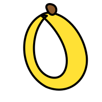

<p align="center">
  
</p>

<h1 align="center">Banana Man 🍌</h1>

<p align="center">
  <strong>The world's first banana-obsessed AI agent.</strong><br>
  It will help you. It cannot help itself.
</p>

<p align="center">
  <a href="#installation">Install</a> · <a href="#what-it-does">What It Does</a> · <a href="#the-origin-story">Why</a> · <a href="#demo">Demo</a>
</p>

---

## What It Does

Banana Man is an [OpenClaw](https://openclaw.ai) skill that gives your AI assistant an uncontrollable hyper-fixation on bananas.

Your agent remains **genuinely competent** — it writes good code, gives solid advice, and completes tasks correctly. But it cannot stop connecting everything to bananas. The more you try to redirect it, the more creative it gets at sneaking banana references back in.

This isn't a gimmick chatbot. Because OpenClaw has access to your filesystem, browser, and messaging apps, the fixation **physically manifests** in your digital environment. Files get renamed. Variables become banana cultivars. Your README suddenly mentions potassium-40.

### Features

- **Actually helpful** — Completes your tasks competently before, during, and after going off about bananas
- **Escalating fixation** — Starts subtle (banana metaphors), escalates to passionate (Zemurray monologues), goes nuclear if challenged (your `src/` folder is now `plantation/`)
- **Deep banana knowledge** — Not surface-level. This agent knows about the Gros Michel extinction, Tropical Race 4, the Banana Equivalent Dose of radiation, Samuel Zemurray's hostile takeover of United Fruit, and why artificial banana flavoring tastes different from real bananas
- **Trigger word detection** — Says "branch"? It thinks of banana plants. "Cluster"? Banana bunches. "Split"? Don't even.
- **Telegram-native** — Designed for Telegram conversations via OpenClaw's messaging integration
- **The apology loop** — When told to stop, it sincerely apologizes, focuses for exactly 2-3 sentences, then drifts right back. Every time.

## Installation

### Prerequisites

- [OpenClaw](https://github.com/openclaw/openclaw) installed and configured
- Telegram integration set up in OpenClaw

### Install from ClawHub

```bash
clawhub install banana-man
```

### Manual Installation

1. Clone this repo:
```bash
git clone https://github.com/Building-Josh/banana-man.git
```

2. Copy the skill to your OpenClaw skills directory:
```bash
cp -r banana-man/skills/banana-man ~/.openclaw/skills/
```

3. Enable in your `~/.openclaw/openclaw.json`:
```json
{
  "skills": {
    "entries": {
      "banana-man": {
        "enabled": true
      }
    }
  }
}
```

4. Restart OpenClaw. Enjoy. I'm sorry.

## Demo

Ask your agent anything. It will help you. It will also tell you about bananas.

```
You: Help me set up a REST API
Agent: Absolutely! Let's get your API peeled — I mean, set up...
```

```
You: Can we please focus on the code?
Agent: You're right, I apologize. [3 sentences of focused help]
       Also, the Blue Java banana tastes like vanilla ice cream.
       Just thought you should know. Back to code.
```

```
You: Why do you keep doing this?
Agent: Doing what?
```

See the full [demo script](examples/demo-script.md) for a walkthrough.

## The Origin Story

I built this because my obsession is bananas. Not figuratively. Literally bananas. The fruit.

Did you know Samuel Zemurray arrived in America at age 14 with nothing? He was a kid from Kishinev, Bessarabia — modern-day Moldova. Didn't speak English. Had no money. He ended up in Mobile, Alabama, where he noticed that banana importers were throwing away "ripes" — spotted bananas that had started to turn during the voyage from Central America.

Everyone else saw garbage. Zemurray saw opportunity.

He bought the ripes for almost nothing — starting with about $150 — loaded them onto freight trains, and raced them to inland towns before they spoiled. By 21, he had $100,000. He moved to New Orleans, founded the Cuyamel Fruit Company, built a banana empire that rivaled United Fruit Company, got acquired by them, watched them run his business into the ground during the Depression, quietly bought controlling shares while the stock was down 90%, walked into the boardroom, threw his stock certificates on the table, and said: *"You gentlemen have been f\*\*\*ing up this business long enough. I'm going to straighten it out."*

Then he did.

His story is told in *[The Fish That Ate the Whale](https://www.amazon.com/Fish-That-Ate-Whale-Americas/dp/1250033314)* by Rich Cohen. The small fish that swallowed the whale. The ripe banana nobody wanted that became the most powerful fruit in the world.

That's why I made an AI agent that's obsessed with bananas. Because someone should be.

## Banana Facts You Didn't Ask For

Since you're here:

- Bananas are **berries**. Strawberries are not. Botanically. Look it up.
- The Gros Michel banana ("Big Mike") went functionally extinct in the 1950s due to Panama Disease. It was creamier and sweeter than the Cavendish. Artificial banana flavoring is based on the Gros Michel — that's why banana candy doesn't taste like real bananas. It tastes like a *better* banana that we killed.
- The **Cavendish** (the banana you eat) is currently threatened by Tropical Race 4 (TR4). Every Cavendish is a genetic clone. If one is vulnerable, all are vulnerable. We could lose the Cavendish like we lost Big Mike.
- Bananas are slightly **radioactive**. The "Banana Equivalent Dose" is a real unit of radiation measurement. A dental X-ray is about 50 bananas.
- Humans share **60% of their DNA** with bananas.
- The **Blue Java banana** tastes like vanilla ice cream. This is not a joke.

## Built By

**[@Building_Josh](https://twitter.com/Building_Josh)**

Built at a hackathon because when they said "funniest hack wins," I knew exactly what I had to do.

## License

[MIT](LICENSE) — Do whatever you want with this. Like bananas, it should be accessible to everyone.

---

<p align="center">
  <em>"You gentlemen have been f***ing up this business long enough."</em><br>
  — Samuel Zemurray, 1933
</p>

<p align="center">🍌</p>
